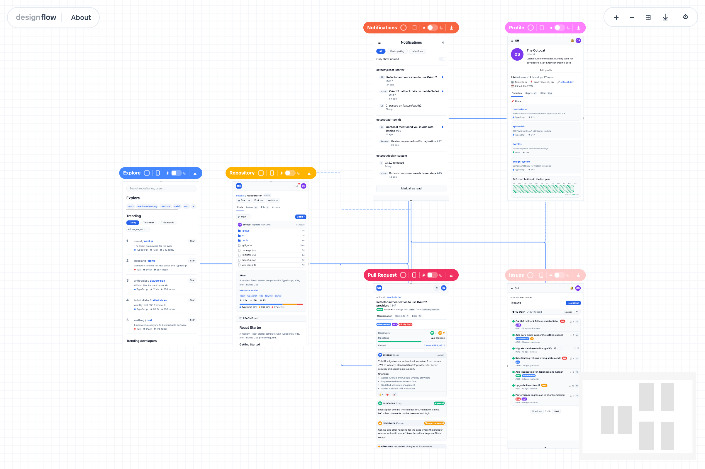

<p align="center">
  
</p>

<h1 align="center">DesignFlow</h1>

<p align="center">
  A Figma-like infinite canvas where every screen is a real React component.<br/>
  Design wireframes, map navigation flows, then eject into production-ready routing code.
</p>

<p align="center">
  <a href="https://designflow.cc">Website</a> &nbsp;|&nbsp;
  <a href="#quick-start">Quick Start</a> &nbsp;|&nbsp;
  <a href="#writing-screens">Docs</a> &nbsp;|&nbsp;
  <a href="https://github.com/jason301c/designflow">GitHub</a>
</p>

---

## Why

AI coding tools generate React screens fast — but there's no way to see them all at once, visualize navigation, or test interactions in context. Figma gives you spatial design but outputs assets, not code.

DesignFlow bridges the gap: **what you design is what you ship.**

## Quick Start

```bash
# Scaffold a wireframes directory with example screens
npx designflow init

# Open the canvas
npx designflow dev
```

This creates a `wireframes/` directory:

```
wireframes/
├── screens/
│   ├── Explore.tsx
│   ├── Repo.tsx
│   ├── Profile.tsx
│   ├── Issues.tsx
│   ├── Pullrequest.tsx
│   └── Notifications.tsx
├── flows.ts
├── designflow.theme.ts
└── CLAUDE.md
```

## Writing Screens

Screens are default-exported React components with zero required props. Style with `var(--df-*)` CSS custom properties or Tailwind classes.

```tsx
export default function Login() {
  return (
    <div style={{ padding: "var(--df-spacing-lg)", background: "var(--df-background)" }}>
      <h1 style={{ color: "var(--df-text)" }}>Welcome back</h1>
      <button data-df-navigate="dashboard">Sign In</button>
    </div>
  )
}
```

| Convention | Description |
|---|---|
| `data-df-navigate="screenId"` | Marks navigation triggers — renders as flow arrows on the canvas |
| `useState`, modals, dropdowns | Local state works normally inside the viewer |
| `var(--df-*)` tokens | Dark mode works automatically when you use theme tokens |

## Defining Flows

`flows.ts` defines screen metadata and directed edges:

```ts
import type { DesignFlowConfig } from "designflow"

const config: DesignFlowConfig = {
  name: "My App",
  screens: {
    login: {
      title: "Login",
      file: "./screens/Login.tsx",
      position: { x: 0, y: 0 },
      viewport: "mobile",     // "desktop" | "tablet" | "mobile"
    },
    dashboard: {
      title: "Dashboard",
      file: "./screens/Dashboard.tsx",
      position: { x: 600, y: 0 },
    },
  },
  edges: [
    { from: "login", to: "dashboard", label: "Sign in" },
  ],
}

export default config
```

Positions persist — dragging nodes on the canvas writes back to `flows.ts`.

## Theming

All design tokens live in `designflow.theme.ts`. The dev server generates CSS custom properties (`--df-*`) from this file with HMR support.

```ts
import type { DesignFlowTheme } from "designflow"

const theme: DesignFlowTheme = {
  colors: {
    primary: "#2563EB",
    secondary: "#7C3AED",
    background: "#FFFFFF",
    surface: "#F8FAFC",
    text: "#0F172A",
    // ... accent, border, textMuted, textInvert, surfaceAlt,
    //     success, warning, error, info
  },
  darkColors: {
    background: "#0F172A",
    surface: "#1E293B",
    text: "#F1F5F9",
    // overrides applied per-screen when toggled to dark
  },
  radius: { sm: "4px", md: "8px", lg: "12px", xl: "16px", full: "9999px" },
  spacing: { xs: "4px", sm: "8px", md: "16px", lg: "24px", xl: "32px", xxl: "48px" },
  typography: {
    fontFamily: "Inter, system-ui, sans-serif",
    heading: { weight: 600, sizes: { h1: "2rem", h2: "1.5rem", h3: "1.25rem" } },
    body: { weight: 400, sizes: { base: "1rem", sm: "0.875rem", xs: "0.75rem" } },
  },
  shadows: {
    sm: "0 1px 2px rgba(0,0,0,0.05)",
    md: "0 4px 6px rgba(0,0,0,0.07)",
    lg: "0 10px 15px rgba(0,0,0,0.1)",
  },
}

export default theme
```

## Tailwind CSS Support

Optionally use Tailwind v4 classes in your screens:

```bash
npx designflow init --tailwind
```

This creates a `styles.css` with an `@theme inline` block mapping DesignFlow tokens to Tailwind's namespace:

```css
@import "tailwindcss";

@theme inline {
  --color-primary: var(--df-primary);
  --color-secondary: var(--df-secondary);
  --radius-md: var(--df-radius-md);
  --spacing-md: var(--df-spacing-md);
  /* ... */
}
```

Then use classes like `bg-primary`, `text-secondary`, `p-md`, `rounded-lg`, `shadow-sm`. Dark mode cascades automatically.

> **Note:** The `@theme` block must use `@theme inline`, not plain `@theme`. Without `inline`, Tailwind v4 generates `@property` declarations that eagerly resolve `var()` at `:root`, breaking the dark mode cascade.

## Canvas Features

- **Infinite canvas** — pan, zoom, fit-to-view
- **Live thumbnails** — screens render as real React components at reduced scale
- **Flow edges** — directed arrows between screens, auto-inferred from `data-df-navigate`
- **Viewer overlay** — click a screen to interact at full size (modals, dropdowns work)
- **Screen-to-screen navigation** — follow `data-df-navigate` links inside the viewer
- **Viewport presets** — toggle desktop (1440x900), tablet (768x1024), mobile (390x844) per screen
- **Per-screen dark mode** — toggle light/dark per screen to preview both variants
- **Canvas settings** — dark/light canvas, accent colors, grid/dots/blank background, line styles
- **PNG export** — export the full canvas or individual screens at full resolution
- **Drag-to-reorder** — positions persist to `flows.ts`

## CLI

```
designflow init [--dir ./path] [--tailwind] [--name "My App"]   # Scaffold wireframes directory
designflow dev  [--dir ./path] [--port 4800]                    # Start canvas dev server
```

## Development

```bash
pnpm install
pnpm test          # Run all tests (240+ passing)
pnpm test:watch    # Watch mode
pnpm dev           # Run the dev server locally
pnpm build         # Build with tsup
```

## Tech Stack

| Layer | Technology |
|---|---|
| Canvas | React Flow v12 (`@xyflow/react`) |
| Dev server | Vite 7 |
| Screens | React 19 |
| Build | tsup (ESM + CJS) |
| Styling | Tailwind v4 (optional), CSS custom properties |
| Testing | Vitest, Testing Library, Playwright |

## License

MIT
